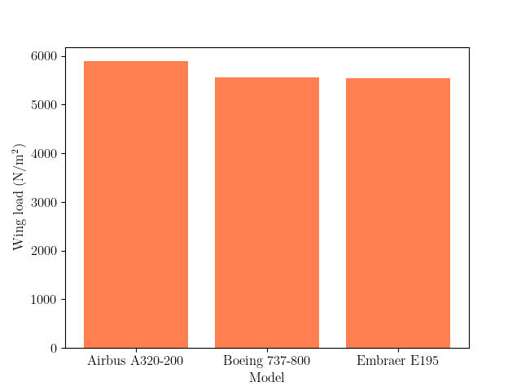

## Motivation

As a physics students, flight dynamics are not commonly taught as part of the course, so I decided to create a programme on Python to help me understand some of the basics, such as the concept of thrust required for level flight. I investigated this at different flight altitudes, and compared how minimum drag airspeed compares to the level flight mach for three different aircrafts: Airbus A320-200, Boeing 737-800, and Embraer E195.

## Background Information

For level flight at a constant speed,

$T=D$ and $L=W$, where T is thrust, D is drag, L is lift, and W is weight.

There are two contributions to the overall drag $D$: the parasite drag and the induced drag. The parasaite drag is a result of friction, and the aircraft's shape. It increases proportioal to $V^2$ (square of aircraft speed). This is what one normally thinks of when thinking of drag. As for induced drag, this occurs from the creation of lift (formation of vortices around wing tip). These vortices result in a downward deflection of airflow, which tilts the lift vector backward and produces a drag component. Contrary to parasite drag, induced drag is proportional to $\frac{1}{V^2}$.

The drag coefficient encompasses both types of drag. A lot of the geometry of the plane does not need to be considered as these details are encapsulated within the coefficients. The resulting drag coefficient becomes:

$C_D=C_{Di}+C_{Dp}$, where $C_{Di}$ is induced drag coefficient and $C_{Dp}$ is the parasite drag coefficient.

$C_{Di}$ can be related to the lift coefficient $C_L$:

$C_{Di}=\frac{C_L^2}{\pi A R e}$, where $AR$ is the wing aspect ratio (wingspan^2/wingarea), and $e$ is efficiency. 

The equation for drag is:

$$D=\frac{1}{2} \rho V^2 S C_D = \frac{1}{2} \rho V^2 S (C_{Dp}+\frac{C_L^2}{\pi A R e})$$,

where $\rho$ is air density (dependent on temperature and altitude) and $S$ is wing reference area.

As mentioned before, for flight to be level at a constant speed, forces must be balanced. Therefore, the thrust required for level flight is:

$$T_R=\frac{1}{2} \rho V^2 S (C_{Dp}+\frac{C_L^2}{\pi A R e})$$.

Since in this instance $L=W$, the lift coefficient is given by:

$C_L=\frac{2L}{\rho V^2 S}=\frac{2W}{\rho V^2 S}$.

Combining all equations, we obtain the final expression for thrust required:

$$T_R=\frac{1}{2} \rho V^2 S (C_{Dp}+\frac{4W^2}{\pi \rho^2 V^4 S^2 A R e})$$

One final important factor to consider in this programme is the change in air density with altitude. The altitudes above sea level considered were 5000 m, 8000 m, 11000 m, 15000 m, and 18000m. Thus, the air density was written as a piecewise function:

$$
\rho(h) =
\begin{cases}
\rho_0 \left(1 - \frac{L h}{T_0}\right)^{\frac{g}{R L} - 1} & \text{if } h < 11000, \\
\rho_{11} \exp\left(\frac{-g (h - h_{11})}{R T_{11}}\right) & \text{if } 11000 \le h < 20000
\end{cases}
$$

The temperature at $h=11000$ m is given by $T_{11}=T_0-Lh_{11}$

## Learning outcomes
- Understand the difference between induced drag and parasite drag.
- Understand the role of coefficients in flight dynamics
- Observe how altitude affects forces in flight
- Compare cruise Mach and minimum drag speed

## Important assumptions

The programme assumed that the weight of the aircraft remains constant throughout the flight, which is not true in a real world context. This is because fuel is consumed during take-off and during the flight, resulting in a decrease in mass and therefore a decrease in weight. As a result, the coefficient of lift used in the programme is an overestimate, which means that drag is lower and thus thrust required is lower overall. 

The model also assumed a constant cruise mach for all heights. 

## Some results

Figure 1. The plot above shows wing load for each aircraft model. A higher wing loading corresponds to each square meter of the wing producing more lift, which means that the aircraft must fly faster to generate enough lift. For a lower wing load, the aircraft can generate lift as lower speeds. Out of all models considered, the Embraer model has the lowers wing load, while Airbus has the greatest one. 

Figure 2. Thrust required vs airspeed for Airbus model for different altitudes. The graph shows a U-shaped curve, created as a result of the contributions of parasite drag (proportional to square of speed) and induced drag (inversely proportional to square of speed). For all heights, the trend shows that high values of thrust are required for level flight at low speeds. The minimum thrust value of this U-shape indicated the minimum-drag speed, which is the speed at which the aircraft experiences the lowest amount of drag. This was repeated for all models. 

Figure 3. Minimum drag speed vs height for all aircrafts, with exponential fit. As altitude increases, the minimum drag speed also increases. This increase is exponential, as shown by the fit which was created using scipy.optimize. As observed from the figure, Embraer has overall lower minimum drag speeds compared to the other two models.

Figure 4. Thrust required vs speed (in Mach), with labeled cruise Mach for Boeing. Speed is converted to Mach units by dividing the airpseed by the speed of sound at a given altitude. The graph shows how minimum drag speed is not equivalent to cruise mach at any point, which means that planes

## Skills used
- Dictionaries for data storage
- Scipy
- Numpy
- Matplotlib
- Functions
- Loops to reduce redundancy
